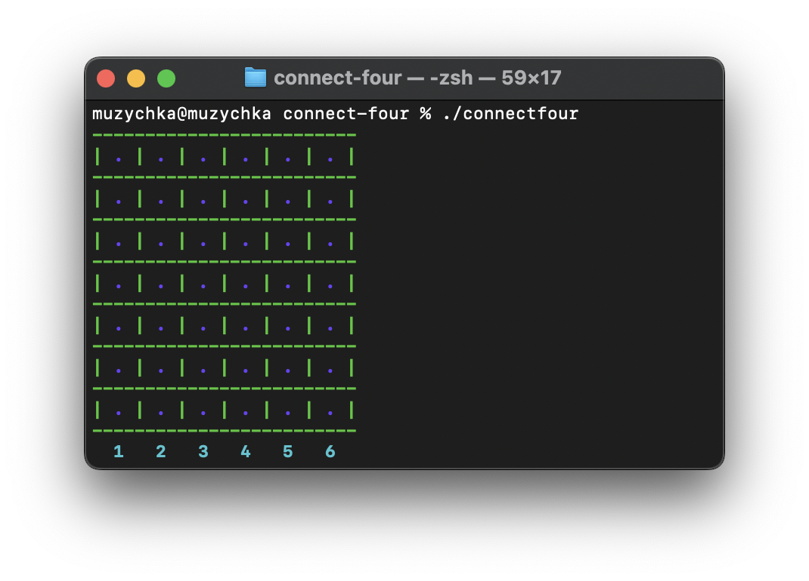
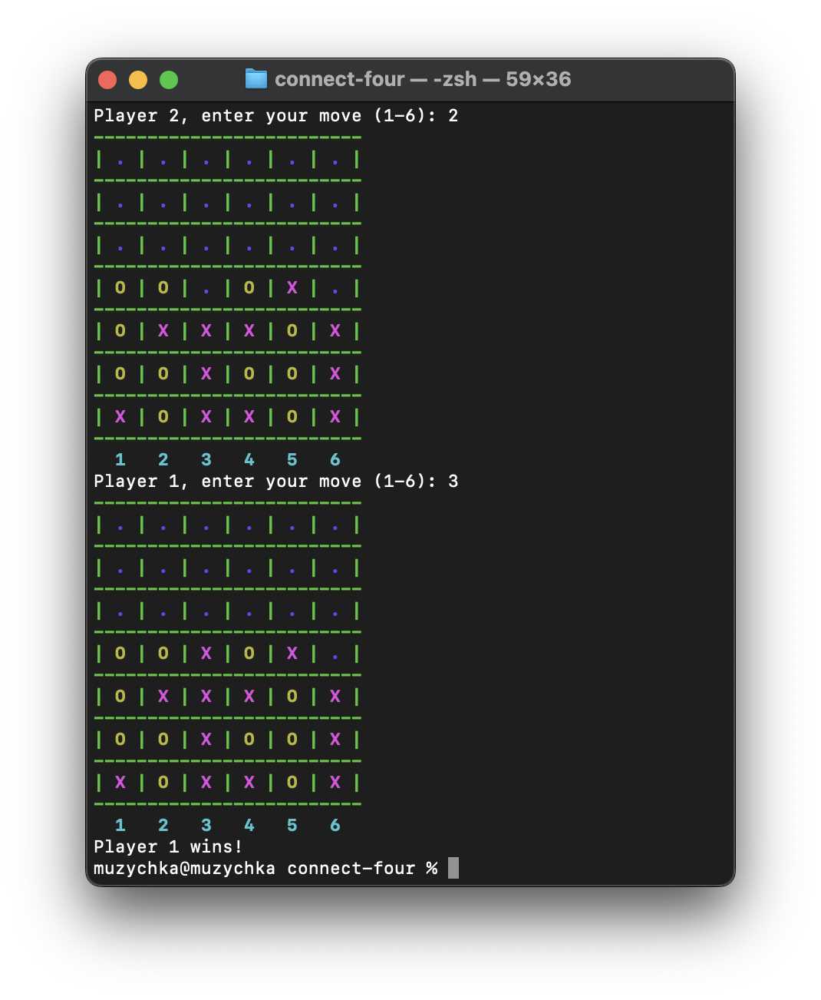

# Connect Four Game  🎮

## Overview

This project implements the classic Connect Four game in C. Players take turns to drop colored discs into columns, aiming to connect four discs in a row, either horizontally, vertically, or diagonally. The game is played on a 7x6 board.



## Files

- `main.c`: Contains the main game logic and user interface. 🧩
- `c4.h`: Header file with function declarations and constants. 📜
- `style.h`: Header file with ANSI escape codes for terminal colors. 🌈



## How to Compile and Run

**Compile** the code using a C compiler:
```bash
gcc -o connectfour main.c
```
**Run** the Game

```bash
./connectfour
```

## Game Functions

### `initialize_board(int rows, int cols, char board[rows][cols])`

**Purpose**: Initializes the game board with empty slots ('.'). 🆗

**Parameters**:
- `rows`: Number of rows in the board.
- `cols`: Number of columns in the board.
- `board`: 2D array representing the game board.

### `print_board(int rows, int cols, const char board[rows][cols])`

**Purpose**: Prints the current state of the game board to the console. 🖨️

**Parameters**:
- `rows`: Number of rows in the board.
- `cols`: Number of columns in the board.
- `board`: 2D array representing the game board.

### `is_valid_move(int rows, int cols, const char board[rows][cols], int col)`

**Purpose**: Checks if a move is valid (i.e., the column is not full). ✅

**Parameters**:
- `rows`: Number of rows in the board.
- `cols`: Number of columns in the board.
- `board`: 2D array representing the game board.
- `col`: The column where the player wants to make a move.

**Returns**: `1` if the move is valid, `0` otherwise.

### `drop_piece(int rows, int cols, char board[rows][cols], int col, char player_piece)`

**Purpose**: Drops a game piece into the specified column. 🎲

**Parameters**:
- `rows`: Number of rows in the board.
- `cols`: Number of columns in the board.
- `board`: 2D array representing the game board.
- `col`: The column where the player wants to make a move.
- `player_piece`: The game piece of the current player.

**Returns**: The row where the piece was placed or `-1` if the column is full.

### `check_win(int rows, int cols, const char board[rows][cols], int row, int col, char player_piece)`

**Purpose**: Checks if the current player has won the game. 🏆

**Parameters**:
- `rows`: Number of rows in the board.
- `cols`: Number of columns in the board.
- `board`: 2D array representing the game board.
- `row`: The row of the last move.
- `col`: The column of the last move.
- `player_piece`: The game piece of the current player.

**Returns**: `1` if the current player has won, `0` otherwise.

### `is_board_full(int rows, int cols, const char board[rows][cols])`

**Purpose**: Checks if the game board is full. 📊

**Parameters**:
- `rows`: Number of rows in the board.
- `cols`: Number of columns in the board.
- `board`: 2D array representing the game board.

**Returns**: `1` if the board is full, `0` otherwise.

## ANSI Color Codes

The game uses ANSI escape codes for terminal colors:

- **Red**: `\x1b[31m`
- **Green**: `\x1b[32m`
- **Yellow**: `\x1b[33m`
- **Blue**: `\x1b[34m`
- **Magenta**: `\x1b[35m`
- **Cyan**: `\x1b[36m`
- **Reset**: `\x1b[0m`
- **Bold**: `\x1b[1m`
